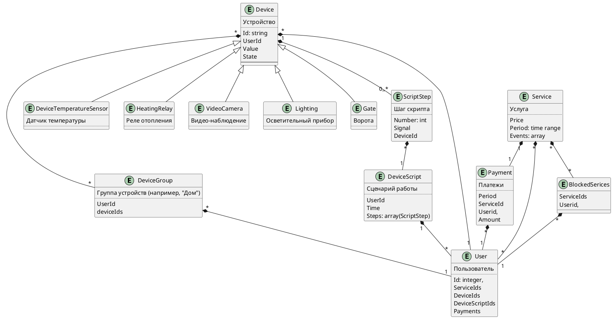

# Анализ монолита

## Функциональности

Бекенд предоставляет следующие возможности клиентам:

1. Получать информацию о отопительной системе
2. Включать отопление
3. Выключать отопление
4. Устанавливать целевую температуру
5. Получать текущую температуру
6. Изменять все параметры системы отопления одним запросом

Фронтенд предоставляет следующие возможности:
1. Управление отоплением: включение, отключение
2. Мониторинг температуры

## Архитектура

0.0. В качестве архитектуры приложения выбранна монолитная многоуровневая архитектура
со следующими уровнями:
    - контроллеры
    - бизнес-логика
    - уровень данных БД

0.1. Уворовни закрыт

1.1. Бекенд предоставляет клиентам синхронное АПИ

1.2. В качестве языка программирования используется Java

Из постановки:

1.3. СУБД Postrgesql

1.4. Для взаимодействия с датчиками используется синхроное АПИ

1.5. В приложени отсуствуют какие-либо предохранительные механизмы для защиты от конкуренции

1.6. Стиль используемой архитектуры: монолитная многоуровневая архитектура. Она имеет следующие свойства:
1. Низкую развертываемость: при малейших изменениях необходимо переразвернуть приложение полностью. Возможно потребуется изменение БД или конфигурации. Изменения могут иметь побочные эффекты, требующие внесения изменений в другие части приложения
2. Низкую тестируемость: при небольших изменениях приходится тестировать все приложение целиком или умозрительно определять те части приложения, на которые могли данные изменения повлиять. Количество функциональностей, собранных в одном приложении, усложняет этот процесс.
3. Среднюю надежность: приложение отсуствуют проблемы связанные с получением данных из других микросервисов по сети (задержки, прерывания запросов и т.д.). У приложения есть сложность с тестированием
4. Низкие адаптируемость и масштабируемость: попытка дорабоать приложение может привести к каскадному изменению больших частей кода из-за высокой связанности компонентов. При возникновении проблем производительности в какой-либо части монолита, масштабировать придется ввсе приложение целиков, что потребует больших ресурсов, нежели масштабирование только проблемной части приложения
5. Низкую отказоустойчивость: при нарушении работы части монолита все приложение целиком перестанет работать
6. Простоту: на начальных этапах разработки монолитное приложение легко разрабывать и оно простое для понимания. Обслуживание приложения достатосно дешевое. При разработке не приходится учитывать проблемы, возникающие в распределенных системак, например, сетевые сбои, сохранение целостности данных или внезапный перезапуск приложений
7. При разростании приложения так же разростается команда, управление которой усложняется.

Приложение разбито на следующие уровни:
1. Уровень данных
2. Уровень бизнес-логики
3. Уровень контроллеров

## Диаграмма контекстов

```plantuml

@startuml
!include https://raw.githubusercontent.com/plantuml-stdlib/C4-PlantUML/master/C4_Context.puml

LAYOUT_WITH_LEGEND()

title Диаграмма контекстов монолитного "теплого дома"

Person_Ext(customer, "Пользователь теплого дома", "Пользователь, который подключился к теплому дому")
System_Ext(device, "Устройство", "Устройство автоматизации")
System_Ext(bank, "Бвнк", "Банк, через который производится оплата услуг")

Enterprise_Boundary(c0, "Теплый дом") {
    Person(employee, "Специалист", "Производит устновку и настройку теплого дома")

    System(device_system, "Модуль управления отоплением", "Позволяет проверять температуру и управлять отоплением")

    System(buhgalteria, "Бухгалтерия", "Ведет денежный учет")
}

Rel(customer, device_system, "Просмотр данных с датчиков")
Rel(customer, device_system, "Управление устройствами")
Rel(customer, bank, "Оплачивает услуги")
Rel(customer, employee, "Запрос на подключение")

Rel(bank, buhgalteria, "Поступление средств")

Rel(buhgalteria, employee, "Сообщение об оплате")
Rel(buhgalteria, employee, "Сообщение о задолжности")
Rel(buhgalteria, customer, "Выставляет счета")

Rel(employee, device_system, "Отключение/включение устройств")
Rel(employee, device_system, "Производит подключение настройку систему")
Rel(employee, device, "Устанавливает устройства")

Rel(device_system, device, "Управление устройством")
Rel(device_system, device, "Запрос телеметрии")

@enduml

```

# Глоссарий

Приложение - приложение на стороне пользователя, которое позволяет управлять отоплением

Отопление - см. Система отопления

Дом - жилище пользователя

Специалист - человек, имеющий специальные знания и навыки по подключению системы отоплнения к приложению

Система отопления - совокупность устройств, используемых для отопления дома

Устройство управление отоплением - механизм, который позволяет управлять системой отопления. Менять температуру, отключать отпление.

Датчик - устройство для проведения измерений

Данные о температуре - некая информация, полученная с датчика

Пользователь - владелец дома или владелей датчиков

Система - набор программ и комопнентов, разрабатываемых компанией, и целью которых является управление отоплением


# Микросервисы
## Основные положения

### Цель доработки

Целью доработки является:
- предоставить пользователю возможность самостоятельного подключения новыйх устройств к своему "теплому дому". Первоначальный набор устройств: устройства управления отоплением, освещением, наблюдением, воротами
- Добавить в систему возможность расширения списка типов устройств управления домашним оборудованием
- Модули управления приборами и сами приборы (устройства) должны быть максимально готовы к использованию и продаваться в отдельных комплектах для удобной покупки и подключения.
- Устройства должны быть доступны через интернет (для удалённого наблюдения и доступа). Предполагается, что пользователь будет иметь интернет-канал, к которому их можно подключить.
- Покупатели должны иметь возможность программировать систему для управления различными модулями в соответствии со своими потребностями.
- Пользователи должны иметь возможность самостоятельно подключать новые модули, управлять ими через интернет и настраивать автоматические сценарии работы устройств
- Через год после запуска Система должна выдерживать не менее 20000 подключенных частных домов
- Обеспечить возможность подключения уствойств сторонних производителей по стандартным протоколам

### Оценка архитектурных свойств

Конфигурируемость - у пользователей должна быть возможость легко добавлять новые устройства, настраивать сценарии  работы устройств
Расширяемость - система должна поддерживать подключение новых модулей для работы с устройствами
Обновляемость - обновления должны проходить незаметно для пользователей
Аутентифицируемость и авторизируемось - пользователяи должны иметь доступ только к своим устройствам. 
Удобство и простота использования - у пользователей должен быть удобный и простой способ управления устройствами и наблюдения за ними
Масштабируемость и производительность - приложение должно выдерживать постоянную монотонновозрастающую нагрузку. Нагрузка распределена географически
Доступность - пользователи должны иметь возможность управления устройствами и наблюдения на за ними в любой момнет времени (24/7)

## Модель предметной области

Ограниченные контексты:
- Профиль пользователя
- Контроль доступа
- Мониторинг
- Услуги и платежи
- Сценарии работы
- Конфигурация
- Устройства


## Схема контекстов

```plantuml

@startuml
!include https://raw.githubusercontent.com/plantuml-stdlib/C4-PlantUML/master/C4_Context.puml

LAYOUT_WITH_LEGEND()

title Диаграмма контекстов "теплого дома"

Person_Ext(customer, "Пользователь теплого дома", "Пользователь, который подключился к теплому дому")
System_Ext(device, "Устройство", "Устройство автоматизации")
System_Ext(main_module, "Модуль управления приборами", "Позволяет управлять остальными устройствами")
System_Ext(bank, "Бвнк", "Банк, через который производится оплата услуг")

Enterprise_Boundary(c0, "Теплый дом") {
    System(access_system, "Система контроля доступа", "Контролирует доступ пользователя к ресурсам")

    System(monitoring_system, "Мониторинг теплого дома", "Собирает данные с датчиков теплого дома")

    System(mamage_service_system, "Система управления услугами и платежами", "Управляет платными услугами")

    System(script_system, "Система управления поведением устройств", "Позволяет управлять сценариями поведения устройств. Запускает выполнение сценариев")

    System(device_system, "Система управления устройствами", "Отвечает за работу с устройствами теплого дома.")
}

Rel(customer, main_module, "Управление теплым домом")
Rel(customer, access_system, "Регистрация")
Rel(customer, mamage_service_system, "Просмотр счетов, подключение новых услуг. Просмотр подключенных услуг")
Rel(customer, device, "Установка и настройка")
Rel(customer, bank, "Оплата услуг")

Rel(main_module, monitoring_system, "Просмотр данных с датчиков")
Rel(main_module, script_system, "Управление автоматизацией работы устройств")
Rel(main_module, device_system, "Управление устройствами")

Rel(monitoring_system, access_system, "Проверка прав доступа")

Rel(script_system, access_system, "Проверка прав доступа")
Rel(script_system, device_system, "Управляющик воздействия на устройства")

Rel(device_system, access_system, "Проверка прав доступа")
Rel(device_system, monitoring_system, "Информации об устройствах")
Rel(device_system, script_system, "Информации об устройствах")
Rel(device_system, device, "Управление устройством")

Rel(mamage_service_system, access_system, "Проверка прав доступа")
Rel(mamage_service_system, monitoring_system, "Данные о платежах и услугах")
Rel(mamage_service_system, script_system, "Данные о платежах и услугах")
Rel(mamage_service_system, device_system, "Данные о платежах и услугах")
Rel(bank, mamage_service_system, "Сообщени е об оплате")

Rel(device, device_system, "Регистрация устройства и привязка к пользователю")
Rel_U(device, monitoring_system, "Передача телеметрии")

@enduml

```

## Схема контейнеров

```plantuml

@startuml
!include https://raw.githubusercontent.com/plantuml-stdlib/C4-PlantUML/master/C4_Container.puml?a


Person(user, "Пользователь", "Пользователь теплого дома")

Container(main_module, "Модуль управления приборами", "Позволяет управлять устройствами")
Container(ma, "Мобильное приложение", "react", "Мобильное приложение, с помощью которого пользователь общается с системов")
Container(device, "Устройство", "Устройство автоматизации")

Container(kafka, "Kafka")

Container(gatewayapi_access_system, "Шлюз")
Container(gatewayapi_monitoring_system, "Шлюз")
Container(gatewayapi_mamage_service_system, "Шлюз")
Container(gatewayapi_script_system, "Шлюз")
Container(gatewayapi_device_system, "Шлюз")

Container(access_system, "Система контроля доступа", "Контролирует доступ пользователя к ресурсам")
Container(monitoring_system, "Мониторинг теплого дома", "Собирает данные с датчиков теплого дома")
Container(mamage_service_system, "Система управления услугами и платежами", "Управляет платными услугами")
Container(script_system, "Система управления поведением устройств", "Позволяет управлять сценариями поведения устройств. Запускает выполнение сценариев")
Container(device_system, "Система управления устройствами", "Отвечает за работу с устройствами теплого дома.")

ContainerDb(db_access_system, "База данных", "PostgreSQL", "Хранить данные о пользователях")
ContainerDb(db_monitoring_system, "Кэш", "Redis", "Хранить последние показания датчиков (кеш)")
ContainerDb(db_mamage_service_system, "База данных", "PostgreSQL", "Хранить данные микросервиса управления услугами")
ContainerDb(db_script_system, "База данных", "PostgreSQL", "Хранит скрипты управляние устройствами и связанные данные")
ContainerDb(db_device_system, "База данных", "PostgreSQL", "Хранит информацию об устройствах")

ContainerQueue(queue_access_system, "Канал для Система контроля доступа")
ContainerQueue(queue_monitoring_system, "Канал для Мониторинг теплого дома")
ContainerQueue(queue_mamage_service_system, "Канал для Система управления услугами и платежами")
ContainerQueue(queue_script_system, "Канал для Система управления поведением устройств")
ContainerQueue(queue_device_system, "Канал для Система управления устройствами")

Rel(user, main_module, "Взаимодействие с системой", "https, websocket")
Rel(user, ma, "Взаимодействие с системой", "https, websocket")

Rel(main_module, gatewayapi_access_system, "Вход в систему", "gRPC")
Rel(main_module, gatewayapi_monitoring_system, "Телеметрия", "gRPC, websocket")
Rel(main_module, gatewayapi_device_system, "Управление устройствами", "gRPC")

Rel(ma, gatewayapi_access_system, "Вход в систему", "gRPC")
Rel(ma, gatewayapi_monitoring_system, "Телеметрия", "gRPC, websocket")
Rel(ma, gatewayapi_mamage_service_system, "Управление услугами", "gRPC")
Rel(ma, gatewayapi_script_system, "Управление автоматизацией", "gRPC")
Rel(ma, gatewayapi_device_system, "Управление устройствами", "gRPC")

Rel(gatewayapi_access_system, access_system, "Регистрация и проверка прав доступа", "gRPC")

Rel(gatewayapi_monitoring_system, monitoring_system, "Создание соединения", "HTTPS")
Rel(gatewayapi_monitoring_system, main_module, "Телеметрия", "websocket")
Rel(gatewayapi_monitoring_system, ma, "Телеметрия", "websocket")

Rel(gatewayapi_mamage_service_system, mamage_service_system, "Просмотр услуг, оплата, подключение", "gRPC")
Rel(gatewayapi_script_system, script_system, "Автоматизация устройств", "gRPC")
Rel(gatewayapi_device_system, device_system, "Управление устройствами", "gRPC")

Rel(access_system, db_access_system, "Данные пользователя", "TCP/IP")

Rel(monitoring_system, gatewayapi_monitoring_system, "Данные с датчиков", "websocket")
Rel(monitoring_system, db_monitoring_system, "Кэш данных с датчиков", "TCP/IP")

Rel(mamage_service_system, db_mamage_service_system, "Данные об услугах", "TCP/IP")

Rel(script_system, db_script_system, "Скрипты", "TCP/IP")

Rel(device_system, db_device_system, "Устройства", "TCP/IP")

Rel(device, monitoring_system, "Замеры", "UDP")

Rel(monitoring_system, queue_monitoring_system, "Получен новый замер")
Rel(mamage_service_system, queue_mamage_service_system, "Услуги заблокированы/разблокированы")
Rel(script_system, queue_script_system, "Настал момент выполнить действие устройству")
Rel(device_system, queue_device_system, "Добавлено/удалено устройство")

Rel(queue_monitoring_system, kafka, "Получен новый замер")
Rel(queue_monitoring_system, monitoring_system, "Услуги заблокированы/разблокированы")
Rel(queue_monitoring_system, monitoring_system, "Добавлено/удалено устройство")

Rel(queue_mamage_service_system, kafka, "Услуги заблокированы/разблокированы")

Rel(queue_script_system, kafka, "Настал момент выполнить действие устройству")
Rel(queue_script_system, script_system, "Услуги заблокированы/разблокированы")
Rel(queue_script_system, script_system, "Добавлено/удалено устройство")

Rel(queue_device_system, kafka, "Добавлено/удалено устройство")
Rel(queue_device_system, device_system, "Настал момент выполнить действие устройству")

Rel(kafka, queue_monitoring_system, "Услуги заблокированы/разблокированы")
Rel(kafka, queue_monitoring_system, "Добавлено/удалено устройство")

Rel(kafka, queue_script_system, "Услуги заблокированы/разблокированы")
Rel(kafka, queue_script_system, "Добавлено/удалено устройство")

Rel(kafka, queue_device_system, "Настал момент выполнить действие устройству")


SHOW_LEGEND()
@enduml

```

## Схемы компонентов
### Микрослужба платежей

```plantuml

@startuml
!include https://raw.githubusercontent.com/plantuml-stdlib/C4-PlantUML/master/C4_Component.puml?a

Person(customer, "Пользователь")

System_Ext(bank, "Система платежей")

ComponentQueue_Ext(queue_mamage_service_system, "Канал для Система управления услугами и платежами")

System_Boundary(mamage_service_system, "Система управления услугами и платежами"){
    Component(handler_payment, "Обработчик оплаты через приложение")
    Component(handler_payment_by_bank, "Обработчик оплаты через платежную систему")
    Component(service_payment, "Служба оплаты")
    Component(respository_payment, "Хранилище оплаты")
    Component(infrastructure_service_payment, "Служба платежной системы")
    ComponentDb(database, "База данных")
}

Rel(customer, handler_payment, "1. Оплачивает через приложение")
Rel_L(handler_payment, customer, "2. Перенаправляет на систему оплаты")
Rel(customer, bank, "3. Оплачивает")

Rel_L(bank, handler_payment_by_bank, "4. Сообщение с номером транзакции")
Rel(handler_payment_by_bank, service_payment, "5. Создает описание оплаты и передает в службу")
Rel(service_payment, respository_payment, "6. Ифнормация о платеже")
Rel(respository_payment, database, "7. Сохраняет оплату в БД")

Rel(bank, handler_payment_by_bank, "8.1. Сообщение о смене состояния оплате")

Rel_U(infrastructure_service_payment, bank, "8.2.1. Периодически проверяет состояние платежей")
Rel(bank, infrastructure_service_payment, "8.2.2. Состояние оплаты")
Rel(infrastructure_service_payment, service_payment, "9. Сообщает о смене состояния платежа")

Rel(service_payment, respository_payment, "10. Обновляет состояние оплаты")
Rel(respository_payment, database, "11. Обновляет состояние оплаты")

Rel(service_payment, queue_mamage_service_system, "12. Отправляет сообщение об успешной оплате")

Rel_D(handler_payment, customer, "13. Сообщает о результате попытке оплаты")

SHOW_LEGEND()
@enduml

```


### Микрослужба мониторинга теплого дома

```plantuml

@startuml
!include https://raw.githubusercontent.com/plantuml-stdlib/C4-PlantUML/master/C4_Component.puml?a

Person(customer, "Пользователь")

System_Ext(device, "Устройство")
System_Ext(main_module, "Модуль управления приборами")
System_Ext(ma, "Мобильное приложение")

System_Boundary(monitoring_system, "Мониторинг теплого дома"){
    Component(handler_create_websocket, "Обработчик запроса на создание канала связи")
    Component(handler_telemetry, "Обработчик запроса телеметрии")
    Component(handler_device_telemetry, "Обработчик сообщений с замерами")
    Component(handler_get_from_cache, "Обработчик запроса данных из кеша")
    Component(handler_service_blocked_unblocker, "Обработчик сообщений от микросервисов")
    ComponentQueue(websocket, "Канал связи с пользовательским устройством")
    ComponentDb(database, "Redis")
}

ComponentQueue_Ext(queue_monitoring_system, "Канал для Мониторинг теплого дома")

Rel(customer, ma, "Просматривает телеметрию")
Rel(customer, main_module, "Просматривает телеметрию")

Rel(ma, handler_create_websocket, "ma.1. Создает канал связи")
Rel(handler_create_websocket, websocket, "ma.2 Создает")
Rel(ma, handler_get_from_cache, "ma.3. Запросить показания для первого отображения")

Rel(main_module, handler_create_websocket, "mm.1, Создает канал связи")
Rel(handler_create_websocket, websocket, "mm.2 Создает")
Rel(main_module, handler_get_from_cache, "mm.3. Запросить показания для первого отображения")

Rel(device, handler_device_telemetry, "d.1. Периодически присылает текущие показания")
Rel(handler_device_telemetry, database, "d.2 Сохраняет показания в кеш")
Rel(handler_device_telemetry, websocket, "d.3 Отправляет показания в незаблокированные каналы связи")
Rel(handler_device_telemetry, queue_monitoring_system, "d.4 Отправляет показания в очередь")
Rel(websocket, ma, "d.4 Отправляет показания на пользовательское устройство")
Rel(websocket, main_module, "d.4 Отправляет показания на пользовательское устройство")

Rel(queue_monitoring_system, handler_service_blocked_unblocker, "q.1. Услага заблокирована/разблокирована")
Rel(handler_service_blocked_unblocker, websocket, "q.2 Заблокировать/разблокировать канал связи")
Rel(handler_service_blocked_unblocker, database, "q.2 Заблокировать/разблокировать доступ к кешу")

Rel(handler_get_from_cache, database, "ma,mm.4. Запросить кеш")
Rel(database, handler_get_from_cache, "ma,mm.5. Вернуть кеш")

Rel_U(handler_get_from_cache, ma, "ma.6. Вернуть кеш")
Rel_U(handler_get_from_cache, main_module, "mm.6. Вернуть кеш")


@enduml

```

### Система контроля доступа

Будет использоваться стандартная реализация, например, Identity server или другой аналог. Схема не требуется

### Система управления устройстваим

Отвечает за добавление добавление новых устройств в теплый дом пользователя и рассылку
данных об этих устройствах в другие сервисы. Позволяет пользователю управлять устройствами
Работает подобно мониторингу, но данные отправляются на устройство

### Система поведения управлением устройств

Хранит пользовательские скрипты управления устройствами и отсылает управляющие воздвействия на устройства
Работает подобно мониторингу, но данные отправляются на устройство

## ER-диаграмма



Пользователь может поподключать множество устройств, услуг, управлять своими сценариями поведения устройств и
объединять устройства в группы. Пользователь может оплачивать услуги

Услуги содержать цену, период оплаты и список событий, которые необходимо разослать в другие сервисы при блокировках
или разблокировках услуг. События универсальные: содержат ИД услуги внутри микросервиса и координаты микрослужбы, которая ее предоставляет.
Список предоставляемых услуш рассылают сами микросервисы через броекр сообщений. Служба управления услугами их накапливает
и управляет через универсальное сообытие

Пользователь может создавать произвольное кличество сценариев с любыми пренадлежащими ему устройствами. Сценарий представляет
собой упорядоченный набор действий, которые необходимо выполнить в заданное время.

Группа устройств - именованное объединение устройств.

Пользователь может оплачивать услуги. При неуплате ему блокируются некоторые виды услуг в каждом из микросервисов
